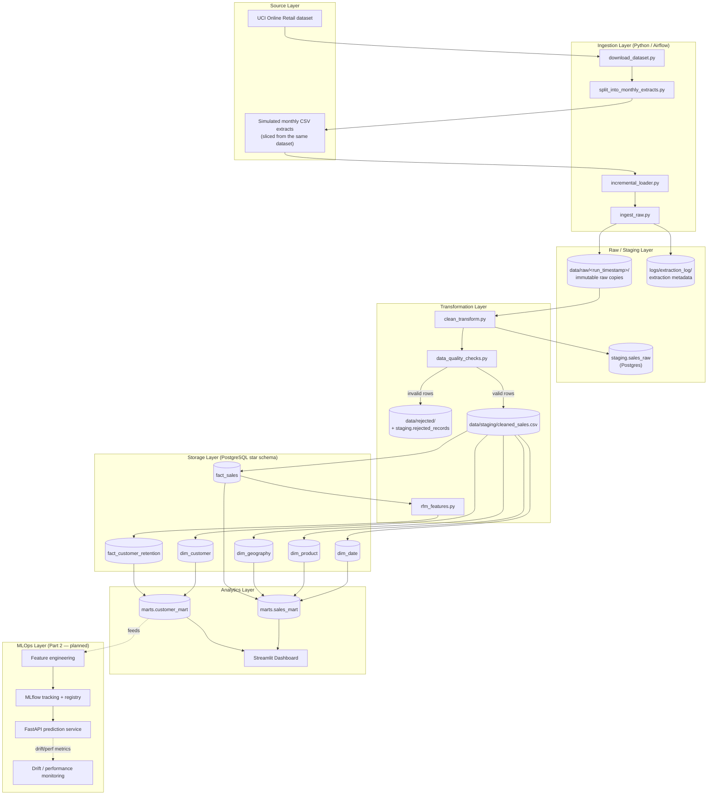

# Architecture Diagram

**Orchestration:** all Ingestion + Transformation + Storage steps above run as tasks in the Airflow DAG `ecommerce_etl_dag` (`airflow/dags/ecommerce_etl_dag.py`), scheduled monthly and triggerable on demand.
