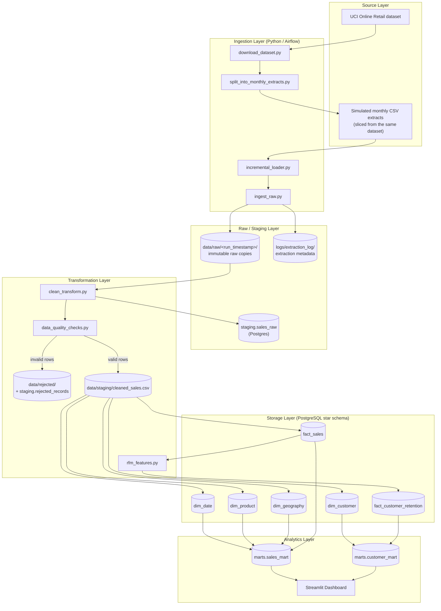
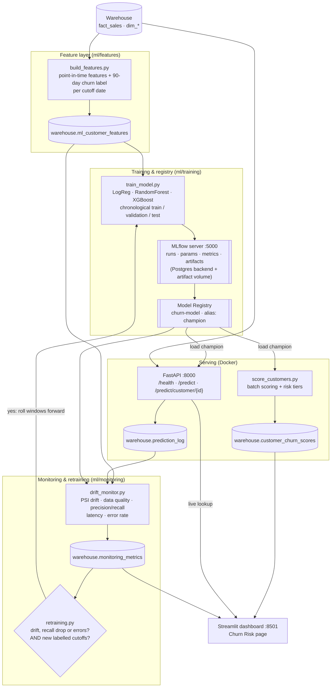

# Architecture Diagram

## Part 1 — Data pipeline

**Orchestration:** ingestion, transformation and storage run as tasks in the Airflow DAG `ecommerce_etl_dag` (`airflow/dags/ecommerce_etl_dag.py`), scheduled monthly and triggerable on demand.

## Part 2 — MLOps layer

**Orchestration:** `ml_pipeline_dag` (`airflow/dags/ml_pipeline_dag.py`, weekly, paused by default) runs
`build_features → monitor → decide_retraining → (retrain_model | skip_retraining) → score_customers`.

**Runtime (`docker compose up -d`):** postgres `:5433` · mlflow `:5000` · api `:8000` · dashboard `:8501` · airflow `:8080`.
